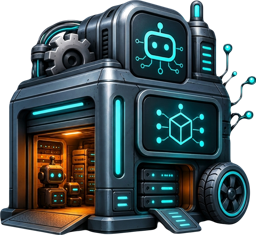

<p align="center"></p>

# AI Garage

**Mission control for your localhost — services, ports, tunnels, and the processes your AI agents left running.** No terminal: see everything that's up, kill a stuck port or a zombie process in one click, expose a service to your phone with a public link, keep services alive — on macOS (and VPS).

[](https://www.npmjs.com/package/ai-garage)
[](LICENSE)
[](#requirements)
[](#how-it-works)

## ▶︎ Run it — one command

```bash
npx ai-garage
```

Then open **http://localhost:7777** in your browser. That's it — no install, no config, no dependencies.

<!-- TODO: add docs/demo.gif here -->

---

## Why

You run a dozen local servers, dev environments and side processes. Then your **AI coding agents** (Claude Code, Cursor, …) spawn even more — and forget to clean them up. Soon a port is *"already in use"* and you don't know by what.

AI Garage is a single pane of glass for all of it:

- **See what's actually running** — saved services *and* every listening port auto-discovered, including the ones AI agents spawned.
- **Free a stuck port in one click** — graceful `SIGTERM`, then `SIGKILL`, with a guard on system/database ports.
- **Start / stop / restart / keep-alive** any service — without touching the terminal.
- **Share to your phone** — a public link (cloudflared) in one click.

## Features

- 🟢🔴 **Live status** of every service (port check), auto-refreshing every 3s.
- ▶ ■ ⟳ **Start / Stop / Restart** with one click; **Keep-alive** that the panel itself supervises (restarts a crashed service).
- 🧹 **Free the port** — kill whatever holds it (the classic *"port already in use"*), with data-loss protection on DB/system ports.
- 🔭 **Auto-discovery** — see every listening process you didn't add, classified (system / database / app / dev / AI-agent) so you don't kill the wrong thing.
- 📱 **Public link** — expose a local port via cloudflared (ngrok & custom domains coming).
- 👁 **Live preview** of a service right inside its card.
- 🤖 **Bots & agents view** — group Telegram bots/agents by the agent backend they run on, with one-click "open in Telegram".
- 🗂 **Sections** for *This Mac / VPS / Bots*, drag-to-reorder, rename, change device.
- 🌍 **19 languages**, switchable in the header.
- 🎨 Clean glass UI with a live cursor highlight.

## 🔌 Connections — one map of every API access on your machine

Your AI stack sprawls across tools: API keys in `.env`, OAuth accounts inside hubs like Composio, and MCP servers wired into **each** AI client separately. Any single agent only sees *its own* config. Nobody has the full picture — and things silently expire.

The **Connections** tab fixes that. It reads the live configs of **all** your AI clients at once and shows:

- **Access map — who can reach what.** Which AI clients (Claude Code, Cursor, Claude Desktop, Antigravity, VS Code, Zed, Windsurf, LM Studio) have access to which MCP service — deduped across clients, auto-discovered from their real config files. Flip it: pick a client, see everything it can reach.
- **One-click grant / revoke.** Give or take away a client's access to a service right from a card — **every config is backed up before any write**, edits are atomic, Claude Code goes through its own `claude mcp add/remove`.
- **Health at a glance.** Every API key checked live — *works / expired / out of credits* in plain words. Keys never leave your Mac.
- **Composio, honest.** Per-service connection status (connected / needs reconnect), one-click OAuth connect, and a catalog of popular apps to add — plus it flags a half-finished CLI login that makes agents throw 401.
- **Honest about blind spots.** It tells you what it *can't* see (a client's UI toggle, a cloud-only hub) instead of faking a green check.

Agents get it too: the MCP server exposes `connections_overview`, `connections_health`, `grant_access`, `composio_connect` — so you can say *"give Cursor the same access Claude Code has"* and it just happens. Security-reviewed adversarially; no secret values ever leave your machine.

## Use with AI agents (MCP)

AI Garage ships an **MCP server** so coding agents can drive it directly — list what's running, free a port, open a tunnel — instead of guessing with `lsof` and `kill -9`.

Add it to your agent (Claude Code, Cursor, …):

```json
{
  "mcpServers": {
    "ai-garage": { "command": "npx", "args": ["-y", "-p", "ai-garage", "ai-garage-mcp"] }
  }
}
```

Tools exposed: `list_services`, `free_port`, `open_tunnel`, `close_tunnel`, `register_service`, and the Connections tools `connections_overview`, `connections_health`, `grant_access`, `composio_connect`.
The panel must be running (`npx ai-garage`); the MCP server talks to it locally.

## How it works

- `server.mjs` — a **zero-dependency** Node server (built-in modules only). Listens on **`127.0.0.1:7777`** only.
- `public/index.html` — the whole UI (vanilla JS, i18n).
- `mcp.mjs` — the zero-dependency MCP server.
- Service registry: `~/.config/localhost-control/services.json`.
- Optional config: `~/.config/localhost-control/config.json`.

### Requirements
Node ≥ 18, macOS (Linux/Windows partially work; keep-alive & some features are macOS-first). `cloudflared` is optional, only for public links.

### `services.json`
```json
{
  "name": "My App",
  "type": "local",
  "port": 3000,
  "url": "http://localhost:3000",
  "cwd": "~/projects/app",
  "startCmd": "npm run dev",
  "stopCmd": "lsof -ti:3000 | xargs kill",
  "host": "Mac",
  "note": "what it is"
}
```
- `type: "local"` — has Start/Stop/Restart buttons (needs `startCmd`/`stopCmd`/`cwd`).
- `type: "link"` — status + link only (managed elsewhere: a VPS, a launchd tunnel, …).

### API
| Method | Path | Body / purpose |
|---|---|---|
| GET  | `/api/status` | all services + discovered ports + tunnel URLs |
| POST | `/api/start` \| `/stop` \| `/restart` | `{ name }` |
| POST | `/api/kill-port` | `{ port }` — free a port |
| POST | `/api/tunnel-start` \| `/tunnel-stop` | `{ port }` — public link |
| POST | `/api/keepalive` | `{ name, enable }` |
| POST | `/api/service-add` \| `/service-remove` \| `/service-rename` | manage the registry |

## Security

- The server binds to **loopback only** (`127.0.0.1`) — not reachable from your network by default.
- **Anti-CSRF / anti-DNS-rebinding:** every mutating request is checked for a same-origin `Origin` and an allowed `Host`. *"localhost-only"* is **not** enough on its own — any open browser tab can POST to `localhost`; most localhost tools ignore this. AI Garage doesn't.
- **Optional token** for sharing. Create `~/.config/localhost-control/config.json`:
  ```json
  { "token": "a-long-random-string" }
  ```
  Then every action requires it (status view stays open).
- ⚠️ The panel can run processes — **don't expose port 7777 to the internet without a token.**
- The `services.json` registry stores start commands; whoever can write to it can run code. Don't give untrusted processes write access.

### Details that other tools skip
- **Zero data leaves your machine.** No cloud, nothing collected — nothing to leak.
- **Freeing a port won't nuke your database.** Soft `SIGTERM` first (lets Postgres/MySQL flush), `SIGKILL` only after 1.2s, plus a warning on system/DB ports. Naïve "kill-port" tools `SIGKILL` instantly.
- **Keep-alive won't thrash your scripts.** The panel supervises and restarts a service only when its port is actually down.
- **It won't kill itself** (port 7777 is guarded) and cleans up after itself.
- **It won't lose your services.** The registry is written atomically (+ backup).
- **Zero dependencies** = no npm supply-chain surface.

## Roadmap

- Link-provider picker — **ngrok (stable URL)** & **custom domain**, alongside cloudflared.
- "Mission control for agents" — read sessions from Cursor / Codex / Claude Code / Cline locally; connect task trackers (GitHub Issues, Notion).
- Cross-machine view (VPS sessions) with a zero-backend reporter.
- Menubar app (Tauri), drag-to-reorder polish, favicons, "start all".

## Contributing

Issues and PRs welcome — especially new UI languages (one object in `public/index.html`) and process-classification rules. MIT licensed: free to use, fork and ship, including commercially.

## License

[MIT](LICENSE) © Az
